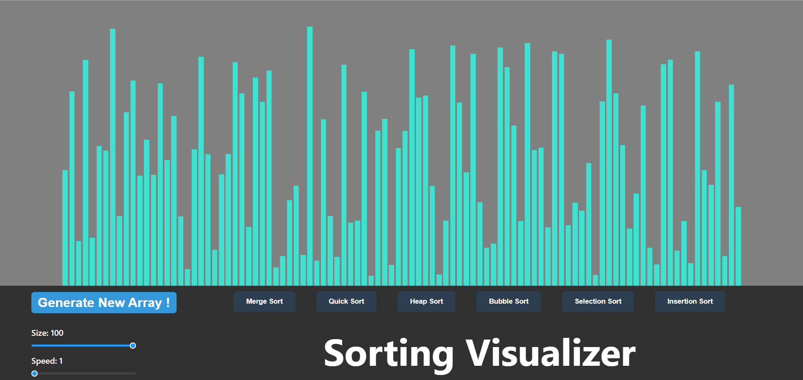

# Sorting Visualizer 

Sorting Visualizer is a React-based web application that allows users to visualize different sorting algorithms in action. It provides an interactive and educational experience to understand how sorting algorithms work step by step.

## 🚀 Features

- Visualization of popular sorting algorithms like:

    - Bubble Sort

    - Selection Sort

    - Insertion Sort

    - Merge Sort

    - Quick Sort

    - Heap Sort

- Adjustable array size and sorting speed

- Step-by-step animation of sorting process

- User-friendly UI with intuitive controls

## 🛠️ Technologies Used

- React.js

- JavaScript (ES6+)

- CSS3

## 📦 Installation

 ```bash
# Clone the repository
git clone https://github.com/your-username/sorting-visualizer.git
```

 ```bash
# Navigate to the project directory
cd sorting-visualizer
```

 ```bash
# Install dependencies
npm install
# End of terminal session
# Start the development server
npm start
```

The app will be available at http://localhost:3000.

## 📌 Usage

1. Select a sorting algorithm from the options.

2. Adjust the array size and speed as needed.

3. Click on the "Start Sorting" button to visualize the algorithm.

4. Observe how elements are sorted step by step with animations.

## 📷 Screenshots



## 💡 How It Works

Each sorting algorithm is implemented in JavaScript and animated using React's state management and rendering optimizations. The visualization updates dynamically as sorting progresses, making it easier to understand the working of each algorithm.

## 🤝 Contributing

Contributions are welcome! If you'd like to improve this project:

 
## Fork the repository

 ```bash
# Create a new branch
git checkout -b feature-branch
```

 ```bash
# Commit your changes
git commit -m 'Added new feature'
```

 ```bash
# Push to the branch
git push origin feature-branch
```

### Open a pull request

## 📜 License

This project is licensed under the MIT License. See the LICENSE file for details.

## 📬 Contact

For any queries or suggestions, feel free to reach out:

GitHub: Aniketghosh2003

## Happy coding! 🎨🚀

